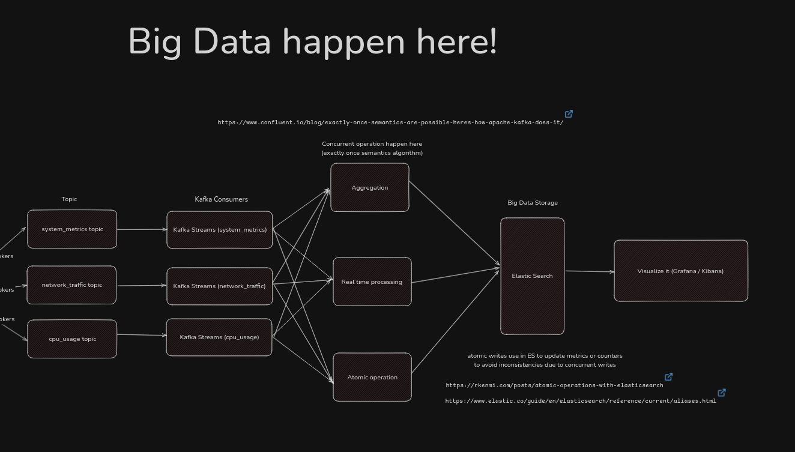

In today’s rapidly evolving digital landscape, real-time system performance monitoring is both a necessity and a challenge. Traditional tools often face limitations, struggling to balance precision, scalability, and system efficiency. But what if we could collect kernel-level data with minimal overhead, process it seamlessly using big data frameworks, and maintain consistent, reliable insights? This project explores that possibility, introducing a novel approach to real-time system monitoring through the integration of eBPF, big data technologies, and atomic operations.

## Abstract

In an era of ever-evolving digital infrastructures, real-time system monitoring is critical to ensuring optimal performance and reliability. Traditional monitoring solutions often face trade-offs between granularity, system overhead, and scalability, leaving gaps in precision and efficiency. This project presents a novel approach by combining eBPF for lightweight kernel-level data collection, Kafka for real-time data streaming, and big data systems for aggregation and analysis. By integrating atomic operations, the system ensures data consistency even under heavy workloads, offering a scalable, efficient, and reliable tool for modern system monitoring needs.

## Problem Statement

Monitoring large-scale systems in real time presents a significant challenge. Traditional tools often fall short, either overburdening the system with resource-intensive processes or failing to provide consistent insights during high-demand scenarios. As system complexity grows, so does the need for an approach that can collect, process, and analyze kernel-level metrics with minimal overhead while maintaining high accuracy and consistency. This project addresses these challenges by developing a scalable and efficient monitoring solution that leverages eBPF, big data frameworks, and atomic operations to overcome the limitations of existing tools.

## Product Context

In today's digital era, where the reliability and performance of systems underpin almost every industry, monitoring infrastructure at scale has become both a critical necessity and a formidable challenge. Traditional tools often lack the finesse to provide granular insights without overwhelming system resources. They either compromise on precision to reduce overhead or introduce inefficiencies that can hamper scalability.

This project aims to redefine real-time system monitoring by leveraging eBPF's ability to observe kernel-level events with near-zero overhead. By integrating it with scalable big data technologies like Kafka and Elasticsearch, the proposed system bridges the gap between granular monitoring and scalable analytics. Atomic operations further ensure that every metric, whether tracked during high-traffic periods or at peak concurrency, remains consistent and reliable.

This architecture sets the foundation for a new paradigm in system monitoring: lightweight, precise, and built to scale seamlessly across modern distributed infrastructures.

## The Proposed Solution

To address these challenges, this project proposes a streamlined system:

1. Efficient Kernel-Level Data Collection: Using eBPF, the tool hooks into critical kernel events such as process lifecycles, file system I/O, and network traffic. It filters and forwards only essential data to minimize impact.
2. Robust Data Aggregation and Analysis: Leveraging Apache Kafka for real-time data streaming and Elasticsearch for indexing and historical storage, the system processes vast amounts of data efficiently.
3. Atomic Operations for Consistency: Updates to metrics - like process counts or network bandwidth - are managed using atomic operations, ensuring reliability even under concurrent workloads.

## What Can I Monitor in the Kernel?

1. System Calls: Track which system calls are being made by processes (e.g., file operations, network requests).
2. Process Lifecycle: Monitor when processes are created, terminated, or modified (e.g., process IDs, memory usage).
3. Network Traffic: Capture and analyze packet-level data, such as incoming/outgoing traffic, connections, etc.
4. CPU and Memory Usage: Monitor real-time CPU usage, memory allocation, and resource consumption by processes.
5. Disk I/O: Observe disk read/write operations, block device activity, and file system changes.

## Why Kernel-Level Monitoring?

1. Precision

    Kernel-level monitoring provides unparalleled granularity, allowing access to detailed insights such as process-level resource usage, network packet flows, and disk I/O patterns. This level of detail is critical for understanding the root causes of system issues that traditional user-space tools often miss.

2. Low Overhead

    Unlike many monitoring solutions that introduce significant performance penalties, eBPF executes directly within the kernel. This ensures minimal impact on system performance, enabling high-frequency, real-time monitoring even on resource-constrained systems.

3. Proactive Problem Detection

    By capturing detailed, real-time metrics at the kernel level, potential bottlenecks or failures can be detected and addressed before they escalate, ensuring optimal system performance and reliability.

## Why eBPF + Big Data Integration?

1. Real-Time Insights

    With Kafka streaming data as it is collected, and Elasticsearch enabling efficient indexing and querying, the system ensures immediate visibility into critical system metrics. This allows for rapid responses to anomalies, such as resource spikes or unexpected traffic patterns.

2. Scalability

    As infrastructures grow in size and complexity, monitoring systems must scale accordingly. By leveraging big data frameworks, this solution accommodates massive data volumes without degradation in performance.

3. Unified Data Pipeline

    The integration of eBPF and big data systems creates a seamless pipeline from data collection to analysis. This avoids the fragmented workflows and inefficiencies typical of conventional monitoring solutions.

## The Architecture

1. Data Collection with eBPF

   Embedded in the kernel, eBPF programs monitor key events such as process starts and stops, network packets, and disk I/O. This raw data is distilled to its essence, minimizing overhead while capturing crucial metrics.

2. Data Aggregation and Storage

   The filtered data flows into Apache Kafka, where it is ingested in real time. Elasticsearch stores and indexes the metrics, enabling historical analysis and efficient querying.

3. Consistency Through Atomicity

   Atomic counters ensure that updates - such as CPU usage spikes or network traffic bursts - re accurate and free from race conditions, even when multiple probes generate concurrent data.

4. User-Friendly Visualization

   A Grafana dashboard brings the data to life, displaying real-time metrics like CPU load, memory usage, and network activity. Alerts for anomalies such as high resource usage ensure timely intervention.

More detailed architecture [see here](https://excalidraw.com/#json=ZUNjxhz2T2ufdiGQ5J4Xh,NCzZ_KUe96pab6HaSdcg5A).



## Technical Implementation Details

The system's implementation is broken down into several key components, each designed to handle specific aspects of kernel-level monitoring and data processing.

### Event Monitoring System

At the core of our implementation is the event monitoring system that captures various kernel-level events:

```rust
#[derive(Clone, Debug)]
pub enum KernelEvent {
    Process(ProcessEvent),
    Network(NetworkEvent),
    FileSystem(FSEvent),
    Memory(MemoryEvent),
}
```

This structure allows us to capture different types of system events:

- Process events track program execution and resource usage
- Network events monitor traffic and connections
- File system events observe disk operations
- Memory events track allocation and usage patterns

### Configuration and Alerting

The system includes configurable alerting thresholds and sampling rates:

```rust
pub struct AlertConfig {
    cpu_threshold: f64,        // e.g., 90% utilization
    memory_threshold: f64,     // e.g., 85% usage
    disk_io_threshold: u64,    // e.g., 5000 IOPS
    network_threshold: u64,    // e.g., 1Gbps sustained
    alert_interval: Duration,  // e.g., 30 seconds
}
```

This configuration allows administrators to:

- Set custom thresholds for different metrics
- Configure sampling rates for different event types
- Define data retention policies
- Manage system overhead

### Data Pipeline Architecture

The data pipeline is built on Kafka and Elasticsearch, with carefully structured topics and schemas:

```rust
pub struct KafkaTopology {
    topics: Vec<Topic>,
    partitions_per_topic: u32,
    replication_factor: u32,
}
```

Elasticsearch schema is optimized for time-series metrics:

```json
{
  "mappings": {
    "properties": {
      "timestamp": { "type": "date" },
      "host": { "type": "keyword" },
      "process_metrics": {
        "properties": {
          "pid": { "type": "long" },
          "cpu_usage": { "type": "float" },
          "memory_usage": { "type": "long" }
        }
      }
    }
  }
}
```

### Performance Benchmarking

The system includes comprehensive performance testing capabilities:

```rust
pub struct PerformanceTargets {
    max_latency: Duration,        // e.g., 100ms
    max_cpu_overhead: f64,        // e.g., 1%
    max_memory_overhead: u64,     // e.g., 256MB
    max_disk_io: u64,             // e.g., 50MB/s
    max_network_overhead: u64,    // e.g., 10MB/s
}
```

Different load scenarios are tested:

- Light load for baseline performance
- Normal operating conditions
- Heavy load for stress testing
- Spike testing for burst scenarios

### Security and Deployment

Security is ensured through comprehensive controls:

```rust
pub struct SecurityConfig {
    capabilities: Vec<Capability>,
    seccomp_filters: SeccompFilter,
    bpf_restrictions: BPFRestrictions,
    audit_logging: AuditConfig,
}
```

Deployment is managed through a structured process:

```rust
pub struct Deployment {
    phases: Vec<DeploymentPhase>,
    verifications: Vec<VerificationStep>,
    rollback_procedures: Vec<RollbackStep>,
}
```

### Testing and Validation

The system includes a comprehensive test suite:

```rust
pub struct TestSuite {
    unit_tests: Vec<UnitTest>,
    integration_tests: Vec<IntegrationTest>,
    performance_tests: Vec<PerformanceTest>,
    security_tests: Vec<SecurityTest>,
}
```

Each component undergoes rigorous testing to ensure:

- Functional correctness
- Performance requirements are met
- Security standards are maintained
- System stability under various conditions

This is just pseudocode describing what will happen in the future.

## Project Versioning and Gitflow

We will be using Git for version control and following [semantic versioning (semver)](https://semver.org/) to manage project releases. Semantic versioning allows us to clearly communicate the nature of changes in each release with a version format of `MAJOR.MINOR.PATCH`.

- **MAJOR** version: Increments when there are incompatible API changes.
- **MINOR** version: Increments when functionality is added in a backward-compatible manner.
- **PATCH** version: Increments for backward-compatible bug fixes.

The code will be hosted on GitHub, under an organization profile (which we will decide later the name of our organization), which will serve as the central repository for our project.

For our branching strategy, we will adopt **trunk-based development** (TBD). This approach encourages frequent integration of small changes into the main branch (the "trunk"), ensuring that the codebase remains in a deployable state at all times. Here's how we'll implement it:

- **Main Branch (Trunk)**: All development will be done directly on the main branch, with developers committing small, incremental changes frequently.
- **Short-Lived Feature Branches**: Although the main branch will always be the focus, we may use short-lived feature branches for specific tasks or experimental changes, which will be merged back into the trunk as quickly as possible.
- **Feature Flags**: If necessary, feature flags will be used to toggle incomplete or experimental features in the main branch, allowing us to keep the codebase stable while developing new functionality.

This strategy reduces merge conflicts and ensures fast delivery, while maintaining code quality through continuous integration.

## Security Considerations

Security is a critical aspect of our kernel-level monitoring system, requiring careful attention to multiple layers of protection and access control.

### Kernel-Level Access Security

Our system's interaction with the kernel requires particularly careful security measures. We implement multiple layers of protection:

1. eBPF Program Safety

   - By default all eBPF programs undergo rigorous verification before deployment, see [eBPF Verifier](https://docs.kernel.org/bpf/verifier.html)
   - Static analysis ensures programs can't harm the kernel
   - Runtime bounds checking prevents unauthorized memory access
   - Strict limits on program complexity and resource usage
   - Automatic detection and prevention of potential infinite loops

2. Privilege Management

   - System operates with minimal required privileges
   - Careful management of capability requirements
   - Automated dropping of unnecessary privileges
   - Strict resource usage limitations to prevent abuse
   - Regular audit of required permissions

3. Data Protection

   - Encryption of sensitive system metrics
   - Secure storage of collected data
   - Data anonymization where appropriate
   - Regular data access auditing
   - Secure transmission protocols for metric collection

## Key Features and Benefits

Unlike traditional tools, this system combines lightweight design with powerful processing capabilities. It doesn’t attempt to solve every problem, but instead focuses on providing accurate, real-time insights into system performance. Its modular design allows for future enhancements, such as predictive analytics or AI-driven anomaly detection.

## Existing Programs

1. Existing Programs

   Traditional system monitoring tools such as Nagios, Prometheus, and Datadog have long been used for gathering and analyzing system metrics. However, they come with their limitations:

   - Prometheus:
     - Strength: Offers powerful querying with PromQL and easy integration with Grafana.
     - Limitation: Collects high-level metrics but struggles with kernel-level insights. Its pull-based model might not suit environments with frequent updates or real-time demands.

   - Nagios:
     - Strength: Effective for basic monitoring with a plugin system for custom metrics.
     - Limitation: Limited scalability and lacks real-time capabilities, especially for large-scale distributed systems.

   - Datadog:
     - Strength: A robust, all-in-one monitoring solution with cloud-native integrations.
     - Limitation: High cost for scaling and restricted customization due to vendor lock-in.

   - eBPF-Based Tools (e.g., BCC, bpftrace):
     - Strength: Provides deep kernel insights and excellent debugging tools.
     - Limitation: Primarily focused on debugging and ad hoc queries rather than ongoing monitoring at scale.

2. Proposed Program

   The proposed program bridges the gap between real-time kernel-level monitoring and scalable big data processing. Here's how it differs:

   - Kernel-Level Insights: Unlike Prometheus or Nagios, it collects fine-grained data directly from the kernel using eBPF.
   - Real-Time Processing: With Apache Kafka handling the data stream, it achieves low-latency processing and ensures timely insights.
   - Consistency and Reliability: Atomic operations ensure accurate updates, overcoming issues like race conditions that traditional tools might face under heavy workloads.
   - Scalability: Leveraging Elasticsearch, it handles vast datasets, making it suitable for large-scale deployments where tools like Nagios might falter.
   - Cost Efficiency: Unlike Datadog, this system doesn’t rely on expensive proprietary solutions and can be fully customized to meet specific needs.

## Why Rust?

Rust is chosen for this project because it aligns perfectly with the performance, safety, and concurrency requirements of a system monitoring tool. Here's why:

1. Performance

    Rust provides low-level control over memory and CPU, matching the performance of C and C++.
    Zero-cost abstractions allow high-level constructs without runtime penalties.

2. Safety

    Rust's memory safety guarantees eliminate entire classes of bugs, such as null pointer dereferences and data races, which are crucial in kernel-level programming and concurrent data handling.
    The ownership model ensures efficient and safe resource management, which is critical for handling high-throughput data streams.

3. Concurrency

    With features like ownership, borrowing, and threads without data races, Rust enables safe and efficient concurrent programming, crucial for handling multiple eBPF events simultaneously.

4. Integration with eBPF

    Rust’s libraries, such as [libbpf-rs](https://github.com/libbpf/libbpf-rs) and [aya](https://aya-rs.dev/book/), simplify writing eBPF programs, providing a modern, type-safe alternative to writing them in C.

5. Ecosystem and Future-Proofing

    Rust's growing adoption, especially in system-level programming, ensures a vibrant ecosystem and long-term support.
    The language is increasingly used in performance-critical projects, including OS components like Linux kernel modules and tools like WebAssembly runtimes, proving its robustness.

## Why Not Other Languages?

- C/C++:
  
  - Pros: Historically used for eBPF and kernel-level tools.
  - Cons: Error-prone, lacks memory safety, and requires extensive manual management of resources.

- Python:
  
  - Pros: Great for rapid prototyping and scripting.
  - Cons: Not suitable for performance-critical, low-level applications due to its interpreted nature and higher memory overhead.

- Go:
  
  - Pros: Excellent for building scalable, high-level services.
  - Cons: Limited support for low-level system programming; garbage collection can introduce latency, making it unsuitable for kernel-level operations.

- Java/Scala:

  - Pros: Powerful for big data processing and enterprise solutions.
  - Cons: JVM-based languages have significant runtime overhead and are unsuitable for kernel-level programming.

## Where Atomic Lives?

1. Atomic Metrics Update:
    - As eBPF collects real-time data (e.g., CPU usage, process creation, network traffic), these metrics need to be updated in the Big Data storage (like Kafka or Elasticsearch).
    - When multiple eBPF probes are generating metrics concurrently (such as multiple processes accessing the same resource), atomic transactions ensure that the metrics are updated without [race conditions](https://www.techtarget.com/searchstorage/definition/race-condition) or inconsistent values.

2. Atomic Aggregation:
    - When processing or aggregating the collected data (e.g., summing up CPU usage across multiple machines), atomic operations can ensure that the results are consistent even in distributed systems where updates happen simultaneously across nodes.

## Evaluating Metrics and Goals

To ensure the system meets its goals, several metrics will be measured:

1. System Overhead: How much CPU and memory does the tool consume?
2. Scalability: Can it handle spikes in data volume without lag?
3. Consistency: Are metrics accurate and free from race conditions?

The goal of this project is to develop a scalable and efficient monitoring system that provides real-time insights into the performance and behavior of a computer system by utilizing eBPF for kernel-level observability, Big Data for handling large volumes of data, and atomic transactions to ensure consistency and reliability.

### Key Objectives

1. Kernel-Level Monitoring with eBPF:

    - Collect detailed and low-overhead system metrics directly from the kernel, such as process activity, network traffic, disk I/O, and resource usage.

2. Real-Time Data Processing:

    - Leverage Big Data tools (e.g., Kafka, Flink) to process and aggregate the collected data at scale in real-time, allowing for fast and efficient analysis.

3. Atomicity for Data Consistency:

    - Ensure data consistency and reliable updates by using atomic transactions, preventing race conditions and conflicts during the processing of system metrics.

4. Scalability and Efficiency:

    - Create a system that can handle large amounts of monitoring data in distributed environments, ensuring it remains scalable without sacrificing performance.

5. System Health and Performance Insights:

    - Provide real-time insights and monitoring dashboards to detect anomalies, track system health, and optimize resource usage for efficient system performance.

### Why This Is Important?

- Scalability: Traditional monitoring systems may struggle with large-scale, distributed systems. This project addresses that by integrating Big Data technologies for scalability.
- Performance: Kernel-level monitoring via eBPF provides high-performance data collection with minimal system overhead.
- Consistency: Atomic transactions ensure that data remains accurate and reliable, even under high-load conditions, which is crucial for real-time monitoring in production environments.

## Project Output

- Web Interface (Amazing)
- CLI (Good) -> likely to be the MVP  (Most Viable Product)

## Potential Applications

From monitoring server performance to optimizing cloud resources and debugging production environments, this tool has a wide range of applications. For instance, a cloud provider could use it to track CPU usage across thousands of virtual machines, while a developer might rely on it to identify system bottlenecks during testing.

## Counterarguments Addressed

1. Why not use existing tools?

   Many tools focus on high-level metrics and can introduce significant overhead. This system optimizes for kernel-level granularity with minimal resource consumption.

2. What if eBPF is too complex?

   The complexity is justified by the performance and accuracy benefits it provides. Moreover, its integration with Big Data pipelines makes the data actionable.

3. Is this scalable?

   With Apache Kafka and Elasticsearch at its core, the system is designed to handle high-throughput workloads, making scalability a non-issue.

4. What if atomic operations slow things down?

   Atomic operations are implemented efficiently to ensure data consistency without significantly impacting performance. The system leverages Kafka’s [exactly-once semantics](https://www.confluent.io/blog/exactly-once-semantics-are-possible-heres-how-apache-kafka-does-it/) and Elasticsearch's [atomic writes](https://www.elastic.co/guide/en/elasticsearch/reference/current/aliases.html) to ensure consistency without introducing noticeable latency.

5. Could contention be a problem with concurrent processing?

   Contention could arise when multiple Kafka consumers or processes attempt to access or modify the same data, leading to delays or conflicts. However, Kafka helps mitigate this by allowing partitioning of topics, enabling parallel processing without interfering with other partitions. Additionally, Elasticsearch provides mechanisms to handle concurrent writes and reads efficiently, reducing contention through techniques like optimistic concurrency control and sharded indexing. By designing the system to minimize resource contention - e.g., distributing load across partitions and utilizing atomic writes where necessary - the risk of significant performance hits from contention is minimized.

6. What if eBPF overhead is still significant?

   While eBPF is designed to be lightweight, there could still be concerns regarding overhead, especially when collecting a large amount of data or performing complex event filtering. To mitigate this, the system can be fine-tuned by selecting only the most relevant events to capture and by using efficient data aggregation and filtering techniques within the eBPF programs themselves, minimizing the data sent to Kafka.

7. What if there are too many data sources or system events?

   As the system scales and we collect data from more sources (e.g., multiple nodes, applications, or kernel events), the volume of data can increase significantly. This could overwhelm Kafka, Elasticsearch, or even cause bottlenecks in processing. To address this, we can introduce additional data partitioning strategies in Kafka, use data aggregation in real-time consumers, and implement backpressure handling to prevent the system from being overwhelmed during peak loads.

8. What if Elasticsearch becomes a bottleneck?

   Elasticsearch can sometimes struggle with performance when indexing large volumes of data in real time. To address this, we can use index management strategies, like rolling indices and time-based indexing (i.e., creating new indices for each time window) to avoid overloading Elasticsearch. Also, sharding and replication can help distribute the load across nodes, ensuring high availability and performance.

9. How do you handle fault tolerance and failure recovery?

   Even with a highly reliable setup like Kafka and Elasticsearch, failures can happen. For example, if a Kafka broker goes down or data is not indexed correctly in Elasticsearch, it could result in lost data or incomplete metrics. Using Kafka's replication and Elasticsearch's replication features ensures data is fault-tolerant and can be recovered in the event of failure. Implementing retry logic and message deduplication in Kafka consumers can further improve fault tolerance and ensure no data is lost.

10. How do you justify the implementation cost?

    Building and maintaining a new monitoring system requires significant resources. We will justify the cost by demonstrating a clear [ROI using Incident Metrics](https://www.atlassian.com/incident-management/kpis/common-metrics) through improved insights, highlighting reduced operational costs, minimizing downtime through enhanced monitoring, and comparing the costs with existing solutions.

11. How do you prevent monitoring cascade failures?

    A failure in the monitoring system could potentially impact the entire system. To mitigate this, we can implement [circuit breaker](https://en.wikipedia.org/wiki/Circuit_breaker_design_pattern) mechanisms and [graceful degradation](https://www.geeksforgeeks.org/graceful-degradation-in-distributed-systems/) strategies.

## Key Innovations

This tool stands out in its:

- Performance: Zero-copy data handling and lock-free structures minimize latency.
- Safety: Memory-safe interactions through Rust and type-safe eBPF integration.
- Scalability: Efficient event handling and smart filtering enable large-scale deployments.

## Risk Management

We've identified several key risks and developed mitigation strategies:

1. Technical Risks

   - Kernel version compatibility challenges
   - Potential performance impacts
   - Data volume management issues
   - Security vulnerabilities
   - Atomic overhead

2. Mitigation Strategies

   - Regular testing across different kernel versions
   - Continuous performance monitoring and optimization
   - Scalable architecture design
   - Frequent security audits
   - Regular backup and recovery testing

## Project Status

This project is still under extensive research by the author and does not guarantee that all intended functionalities will be implemented. If you have any suggestions or questions, feel free to reach out <a href="mailto:ezrantn@proton.me">ezrantn@proton.me</a>.

## Where Do I Get This Idea?

References are sourced from the following:

1. [The Rise of eBPF for Non-Intrusive Performance Monitoring](https://www.researchgate.net/publication/342016524_The_rise_of_eBPF_for_non-intrusive_performance_monitoring)
2. [A Study of Apache Kafka in Big Data Stream Processing](https://ieeexplore.ieee.org/document/8533771)
3. [eBPF and How Tech Giants Use It to Uplevel Observability](https://deploy.equinix.com/blog/ebpf-explained-enhancing-system-observability-and-monitoring/)
4. [A Study on Developing Resilient Big Data Stream Processing Applications using Apache Kafka](https://www.researchgate.net/publication/353451970_A_Study_on_Developing_Resilient_Big_Data_Stream_Processing_Applications_using_Apache_Kafka)
5. [Research on Establish an Efficient Log Analysis System with Kafka and Elastic Search](https://www.researchgate.net/publication/320712854_Research_on_Establish_an_Efficient_Log_Analysis_System_with_Kafka_and_Elastic_Search)

## Conclusion

This project is a step toward the future of system monitoring: lightweight, scalable, and reliable. By combining the strengths of eBPF, Big Data, and atomic operations, it offers a tool that not only meets current needs but also lays the foundation for advanced features in the future.

With its focus on performance, scalability, and consistency, this system represents a significant improvement over traditional monitoring tools. Its modular design ensures that it can evolve with the ever-changing landscape of system monitoring.
