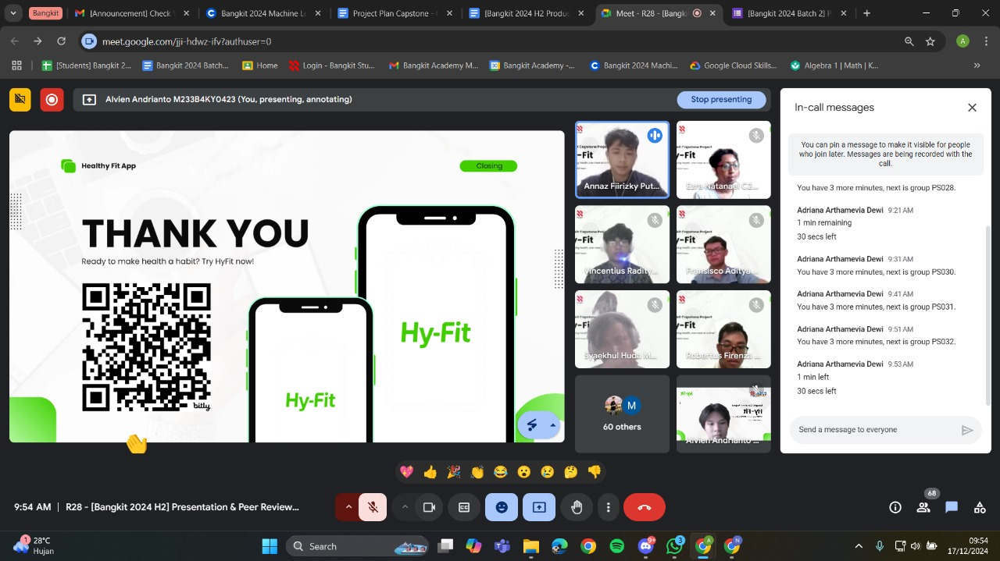

My nearly four-month journey in Bangkit has finally come to an end. It all started when I was 19 years old and saw my senior join the program. At first, I had no idea what Bangkit was, but after researching, it instantly caught my attention.

As mentioned in my previous article, Bangkit is a program initiated by major companies like Google and Tokopedia to provide high-quality training in specific areas. At the time of writing, Bangkit offers three learning paths:

- Cloud Computing (my choice)
- Mobile Development
- Machine Learning

The program aims to equip Indonesians with practical, industry-relevant skills, addressing gaps left by traditional university curricula. Bangkit focuses on solving real-world problems systematically.

Each learning path has its own curriculum and resources:

- Cloud Computing: Materials from Google Cloud Skill Boost (GCSB) and Dicoding. Participants receive a special GCSB account, while Dicoding uses personal accounts.
- Machine Learning: Resources from Dicoding and Coursera, with a special Coursera account provided.
- Mobile Development: Entirely based on Dicoding materials, accessed via personal accounts.

The program relies heavily on self-learning, which might seem daunting at first but is manageable with resilience and good time management.

In addition to self-paced courses, Bangkit provides Instructor-Led Training (ILT) sessions. These sessions allow participants to engage with instructors, discuss material, and ask questions.

For Cloud Computing, there are seven ILTs covering topics ranging from the basics of cloud computing to advanced topics like machine learning deployment. ILTs for the other paths may vary.

The capstone project is the culmination of the Bangkit journey, requiring collaboration between participants from different learning paths. Each team, typically consisting of 6–7 members, works together to create a product.

My team comprised:

- 2 Cloud Computing participants
- 3 Machine Learning participants
- 2 Mobile Development participants

We brainstormed and decided to create Hyfit, a calorie-tracking app with food-scanning capabilities. The original idea included features like workout management and meal planning, but due to the tight one-month deadline, we focused on:

- Authentication
- Profile management
- Food scanner functionality

As a Cloud Computing participant, I was responsible for the backend and cloud deployment. We used:

- NestJS for backend development (chosen over Go for team familiarity)
- Cloud Run for deployment
- Cloud SQL with PostgreSQL as the database
- Cloud Storage for model deployment

We faced challenges, such as running out of cloud credits due to configuration errors. Fortunately, Bangkit provided additional credits upon request.

The Machine Learning team developed the image recognition model, while the Mobile Development team created the frontend and integrated it with our APIs.

The capstone project required two presentations:

- Application Demo: A recorded demo showcasing the project’s features, tech stack, and a SWOT analysis.
- Peer Review: A live presentation evaluated by judges and peer teams.

During the peer review, each team had 10 minutes to present. While nerve-wracking, our preparation paid off, and we successfully delivered our presentation.

Completing the Bangkit program has been an incredible milestone. I’m immensely grateful to my teammates - Renza, Adit, Alvien, Radit, Annaz, and Huda - for their dedication and collaboration.

This journey has taught me resilience, teamwork, and the value of practical learning. If you’re considering joining Bangkit, remember to appreciate and support your teammates. Their encouragement can make all the difference during challenging times.

Thank you for reading and following along on my Bangkit journey. Peace out!
